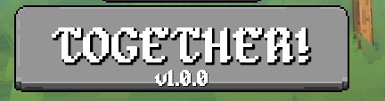

# megabonk-together

<p align="center">
  
</p>

<!-- Shield -->

[](https://patreon.com/DShadModdingAdventure)
[![Contributors][contributors-shield]][contributors-url]
[![Download][download-shield]][download-url]
[![Forks][forks-shield]][forks-url]
[![Stargazers][stars-shield]][stars-url]
[![Issues][issues-shield]][issues-url]
[![MIT License][license-shield]][license-url]

# About The Mod

Megabonk together is a WIP mod that bring netplay to megabonk.

This mod feature:

- Peer to peer online up to 6 players (Relay transport for ipv6 addresses or when ipv4 direct connection failed)
- Random and private queue
- Mostly (not all) in game mechanics synchronized
  - Weapons (also their updgrade)
  - Projectiles (not perfect for all)
  - Monsters (follow, target, attacks)
  - Chest
  - Shrines
  - Portal
  - Challenges
  - and probably other i forgot
- Death cam
- Custom balance to match the number of players (Probably unbalanced right now but it can be tuned later)
- Auto-update
- Probably won't work with other non cosmetic mods

More info at [Notable Network Changes](./NETPLAY_CHANGES.md)

## Changelog

<details>
<summary>📋 Click to view full changelog</summary>

### v5.0.0

- 🐧 **Added Proton support**: You can now play with friends on Steam using Proton/Steam Deck, with cross-play on Windows. This is also an experimental and might not work perfectly

### v4.2.2

- 🚀 **Attempt to fix FPS issues**: Less critical updates are now sent unreliably, which improves bandwidth and CPU usage
- 🔧 **Attempt to fix some desync issues (Shared Experience)**: Some packets were dropped in some scenarios. Critical interactions are now sent reliably, which should prevent desync issues

### v4.2.1

- 🛠️ **Reworked damage calculation**: Some items/projectiles were not applying damage correctly. This is now globally resolved (some items still have issues, will try to fix later)

### v4.2.0

- 🚀 **More code optimizations again !**
- 🧩 **Some items fixes**: Prevent Soul Harvester / Chaos tome triggering even when not owned

### v4.1.0

- 🚀 **More improvements to tackle FPS issues**

### v4.0.3

- 🪙 **Fixed Gold desync (Shared Experience)**: Gold sharing has been reworked. Gains are now shared across everyone, while losses are applied individually. Players who can’t afford a chest are paused until eligible players finish

### v4.0.2

- 🪙 **Attempt to fix gold desync (Shared Experience)**: Computing delta instead of raw changes

### v4.0.1

- 🔄 **Attempt to fix encounter desync (Shared Experience)**: Better handling of multiple encounters occurring at the same time. It should prevent deadlocks (though laggy players might still cause issues). This fix should at least help for now.

### v4.0.0

- ✨ **Added Shared Experience mode (Experimental!)**: Shared XP, Gold and interactions across all players. This also implies an active pause on every interaction. The original mode is still available
- 🎮 **Added 'Netplay options' button**: Now gathers all netplay related options (Shared Experience and Save progression)
- 🐛 **Fixed some boss not rendering** sometimes for some reason

### v3.0.0

- ⚡ **Added a distance throttler for enemies**: They will not update / be rendered when too far away. Same idea for projectiles (reduced opacity for far away projectiles). This should help improve FPS
- 👻 **Rebalanced Reviver** to make them less punishing early (start at low health and increase per player per death)

### v2.0.2

- 🐛 **Fixed item Ghost crashing**: This was the main reason everyone was crashing
- 🐸 **Added egg interaction support**
- 🎯 **Fixed client side Challenge shrines interactions** not working properly

### v2.0.1

- 💾 **Added option** to allow saving in netplay sessions. Use at your own risk
- 📦 **Properly queue encounter rewards** to prevent missing rewards when multiple encounters happen simultaneously. This should also fix random crash hopefully
- 📊 **Properly track kills/money** per player
- 🔌 **Fixed disconnection issues** preventing reconnection
- 🎮 **Fixed button selection reset issue** in character window
- 🎯 **Fixed projectile not despawning** in singleplayer mode
- 🔗 **Fixed some connection issues** in relay mode for some users

### v2.0.0

- 🎉 **Added changelog system**: See what's new after each update!
- 🎮 **Implemented Friendlies**: A private queue system. One host share a code and other join with it.
- ⚰️ **Added a new interactable, Reviver**: When a player die, it will now spawn a Coffin. Other player have to defeat his ghost to respawn the dead player

### v1.3.0

- 🛒 **Thunderstore support**: No auto update for thunderstore as they have to update throught the website or r2modman
- ⚖️ **Balance change**: Reduced Credits earning to limit a bit spawned enemies

### v1.2.0

- 📊 **Add latency indicator to the host**: The host see latency for all clients

### v1.1.0

- 🔄 **Generate updater on the fly**

### v1.0.0

- 🚀 **Initial release !** Thanks for trying the mod

</details>

# Install

This mod has only been developed and tested on windows, probably won't work on other platform (Is the game can even be run on Linux/Mac even ?)

Also this mod was developed for the 1.0.49 version (ok let me rant a bit, it was developed on previous update but Graveyard update broke some major stuff, i was a bit mad but its okay now, i fixed all the stuff), meaning it will probably break when an official major update drop .

> [!NOTE]  
> Before starting, i suggest to make a backup of your current save file just in case.
> The game save is somewhere at `{user}/AppData/LocalLow/Ved/Megabonk/Saves/CloudDir/{some steam id guess}`

> You can also just copy all at `{user}/AppData/LocalLow/Ved/Megabonk` if not sure

> Make sure to copy your save somewhere in case you need to restore it back for some reason

This mod run with [BepInEX 6 Bleeding Edge Build](https://builds.bepinex.dev/projects/bepinex_be) (tested on the current latest #752):

Start by downloading the BepInex loader [BepInEx-Unity.IL2CPP-win-x64-6.0.0-be.752](https://builds.bepinex.dev/projects/bepinex_be/752/BepInEx-Unity.IL2CPP-win-x64-6.0.0-be.752%2Bdd0655f.zip) in your game directory (Where your Megabonk.exe is). This mean you want to extract BepInEx at something like `{your own path}\steamapps\common\Megabonk`

> [!NOTE]  
> We specifically target the IL2CPP version (.IL2CPP) in the BepInEx build page and also the windows (-win) and the 64 bits (-x64) version of BepInex.

> Not sure if i will upgrade this page every new BepInEx update this how you know what version you should get

> Also i dont know if 64 bits is tied with how the game was built or your system , if the 64 bits version is not working, i guess you should try the 32 bits (x86) version (something like `BepInEx-Unity.IL2CPP-win-x86-6.0.0-be`)

- Launch the game first at least one time to confirm BepInEx is working (Wait for the main menu as BepInEx need to make some dummy dll). Yous should see a terminal opened along side with the game with some logs in it

- After exiting the game,grab and download the [latest release](https://github.com/Fcornaire/megabonk-together/releases/latest)

- Extract the zip and copy the folder `Megabonk-Together` to the plugins path of BepInEx , something like `../steamapps/common/Megabonk/BepInEx/plugins`

- Launch the game and confirm a new weird `Togther!` button is at the bottom of the main screen

> [!NOTE]  
> The button is not navigable right now, you won't be able to select it with a controller , use your mouse to interact with it (You can pick your controller later)
> Will try to fix later

- Enjoy ! Do not hesitate to open an [issue](https://github.com/Fcornaire/megabonk-together/issues) if you encounter a bug or something isn't working

# How to play

## Random

Play on a random queue, the next 6 players within a time period will get matched together (no pun intended)

## Friendlies

Private queue, Host as to share the room code (copy from the uper right button) and paste it to the players he want to play with

# Self-Hosting a Server

If you want to run your own matchmaking/relay server, check the [Self-Hosting Guide](docs/Setup-Own-Server.md).

# Known issue

- For some obscure reason, The game crash when loading the map. this is mostly rare and you can just close and restart the game if it ever happen. Dunno why it sometimes crash here ¯\_(ツ)\_/¯
- Not all the stuff happening in the game are perfectly synchronized, like getting money when you shouldn't or ghost item not spawning or whatever. I will mostly be looking for game breaking bug before looking at those

# Building (Developer)

- Clone this repository
- Set the environment variable **MegabonkPath** pointing to your own game install (something like _../steamapps/common/Megabonk_) for your IDE to know where to get the required DLLs to load for building the mod
- Build the solution

You should now have the macthmaking server built and also the mod file

> [!IMPORTANT]  
> The IDE will copy the result mod file in your game directory. This is super practical when developing locally but remember to delete it after.

To target a local server, modify the file `{your game path}/BepInEx/config/MegabonkTogether.cfg` and update [Network].ServerUrl to `ws://127.0.0.1:5000`

# Linux Support (Proton / Steam Deck)

The mod is compatible with Linux via **Proton**. Native Linux support is currently experimental and unstable due to BepInEx 6 compatibility issues with newer kernels (glibc/CET conflicts).

## Installation

1. **Configure Game for Proton:**
   - In Steam, right-click **Megabonk** -> **Properties** -> **Compatibility**.
   - Check "Force the use of a specific Steam Play compatibility tool".
   - Select **Proton 9.0** (or Experimental).

2. **Install BepInEx 6 (Windows x64):**
   - Download the latest `BepInEx-Unity.IL2CPP-win-x64-6.0.0-be.*` build from [BepisBuilds](https://builds.bepinex.dev/projects/bepinex_be).
   - Extract the contents directly into your game directory (`.../steamapps/common/Megabonk/`).
   - **Crucial:** You must see `winhttp.dll` next to `Megabonk.exe`.

3. **Configure Launch Options:**
   - In Steam Properties -> General -> Launch Options, add:
     ```bash
     WINEDLLOVERRIDES="winhttp=n,b" %command%
     ```
   - _This tells Proton to load the local `winhttp.dll` (BepInEx) instead of the system one._

4. **First Run:**
   - Launch the game once to let BepInEx generate the interop assemblies. This might take a minute on the splash screen.

5. **Install the Mod:**
   - Download the latest proton [release](https://github.com/Fcornaire/megabonk-together/releases/latest) (in the release page, grab the -proton zip).
   - Extract the `Megabonk-Together` folder into `.../Megabonk/BepInEx/plugins/`.

After installation, your Megabonk directory should look like this:

```text
Megabonk/
├── BepInEx/
│   ├── core/
│   ├── config/
│   ├── interop/             <-- Generated on first run
│   ├── unity-libs/          <-- Generated on first run
│   └── plugins/
│       └── MegabonkTogether/
│           ├── MegabonkTogether.dll
│           ├── MegabonkTogether.Common.dll
│           └── (other dependency DLLs)
├── Megabonk_Data/
├── winhttp.dll
├── doorstop_config.ini
├── Megabonk.exe
├── GameAssembly.dll
└── UnityPlayer.dll
```

## Building on Linux

You can build the mod natively on Linux using the .NET 8 SDK.

- Ensure `dotnet-sdk-8.0` is installed.
- Clone the repository.
- Run the build script:

  ```bash
  ./scripts/proton/build.sh
  ```

- A `Directory.Build.props` file can be used to override the `MegabonkPath` if your game is installed elsewhere.

```xml
<Project>
  <PropertyGroup>
    <MegabonkPath>/home/user/.local/share/Steam/steamapps/common/Megabonk</MegabonkPath>
  </PropertyGroup>
</Project>
```

# Social

Bsky : [Dshad66](https://bsky.app/profile/dshad66.bsky.social)

Twitter : DShad - [@DShad66](https://twitter.com/DShad66)

Discord : dshad (was DShad#4670)

<!-- MARKDOWN LINKS & IMAGES -->
<!-- https://www.markdownguide.org/basic-syntax/#reference-style-links -->

[contributors-shield]: https://img.shields.io/github/contributors/Fcornaire/megabonk-together.svg?style=for-the-badge
[contributors-url]: https://github.com/Fcornaire/megabonk-together/graphs/contributors
[forks-shield]: https://img.shields.io/github/forks/Fcornaire/megabonk-together.svg?style=for-the-badge
[forks-url]: https://github.com/Fcornaire/megabonk-together/network/members
[stars-shield]: https://img.shields.io/github/stars/Fcornaire/megabonk-together.svg?style=for-the-badge
[stars-url]: https://github.com/Fcornaire/megabonk-together/stargazers
[issues-shield]: https://img.shields.io/github/issues/Fcornaire/megabonk-togethersvg?style=for-the-badge
[issues-url]: https://github.com/Fcornaire/megabonk-together/issues
[license-shield]: https://img.shields.io/github/license/Fcornaire/megabonk-together.svg?style=for-the-badge
[download-shield]: https://img.shields.io/github/downloads/Fcornaire/megabonk-together/total?style=for-the-badge
[download-url]: https://github.com/Fcornaire/megabonk-together/releases
[license-url]: https://github.com/Fcornaire/megabonk-together/blob/master/LICENSE.txt
